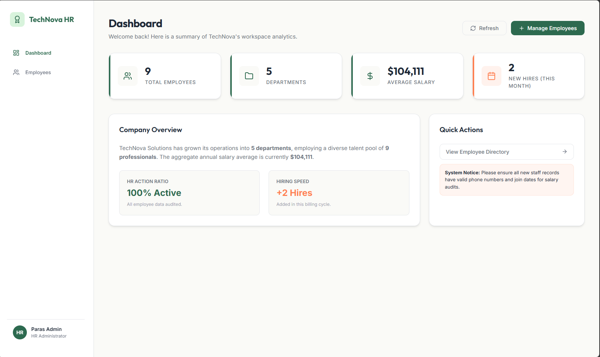
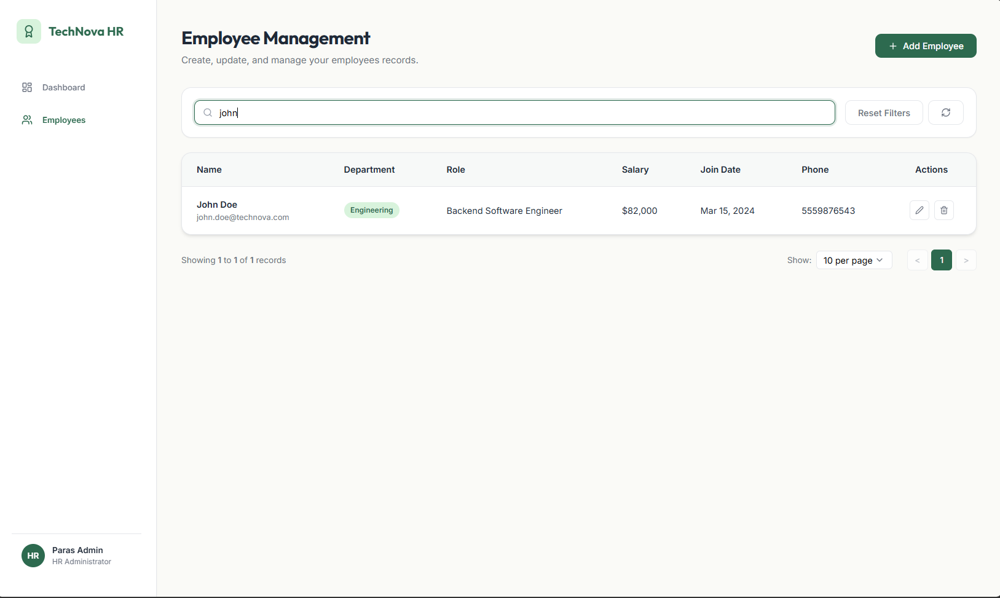
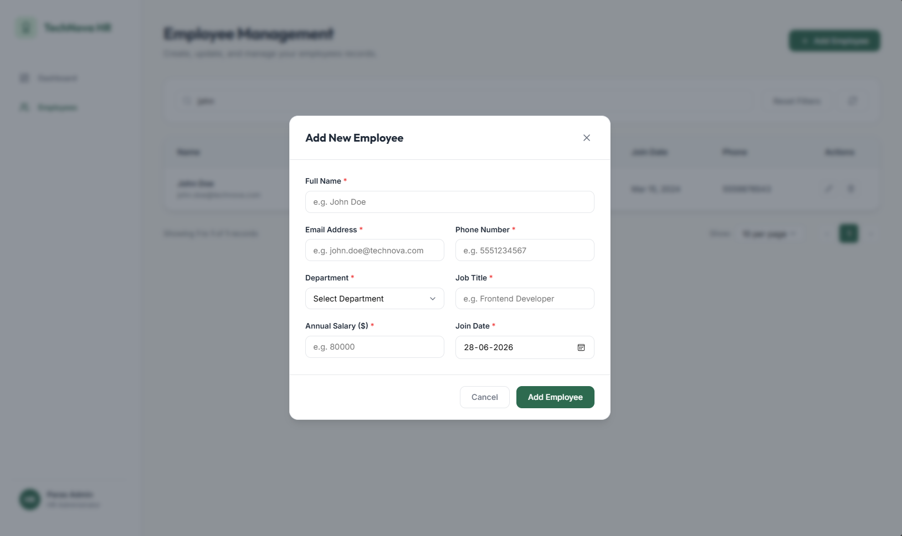
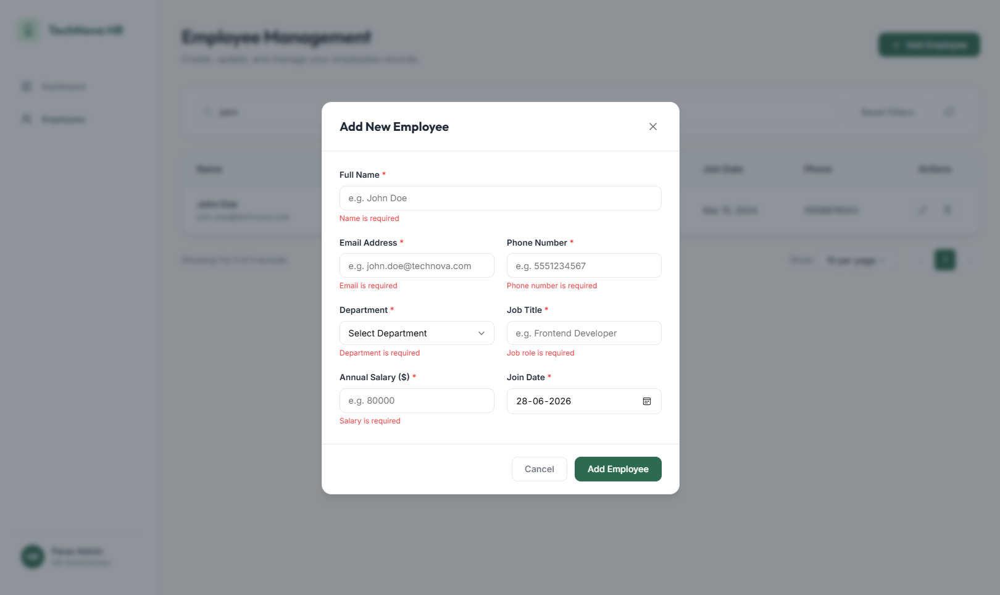
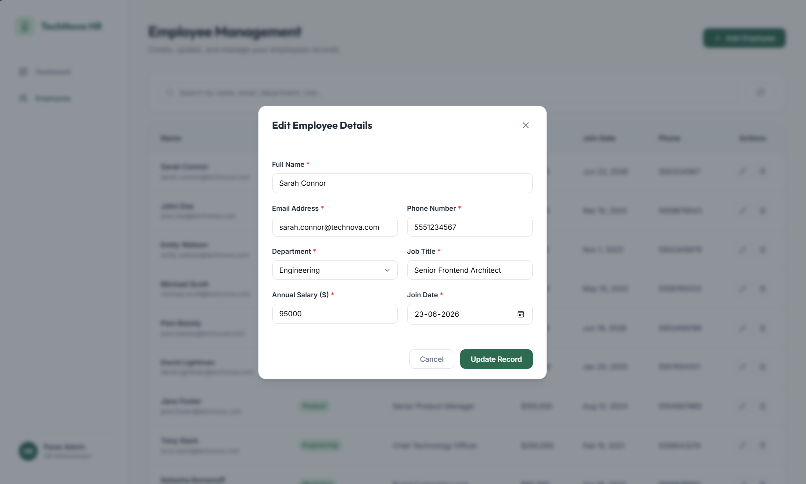
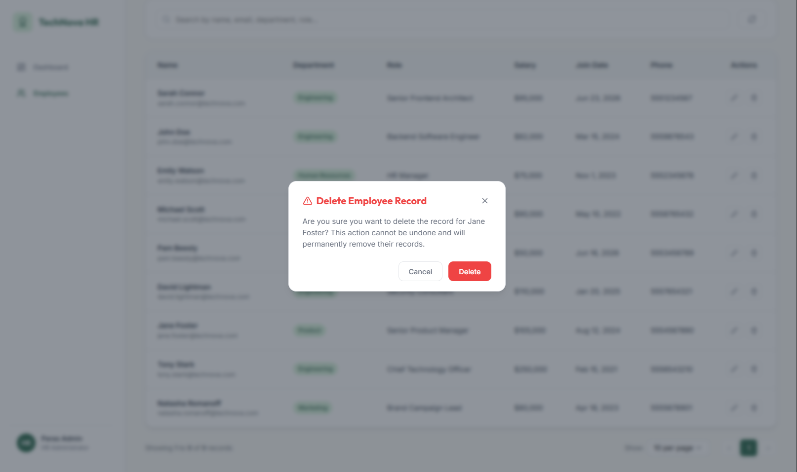
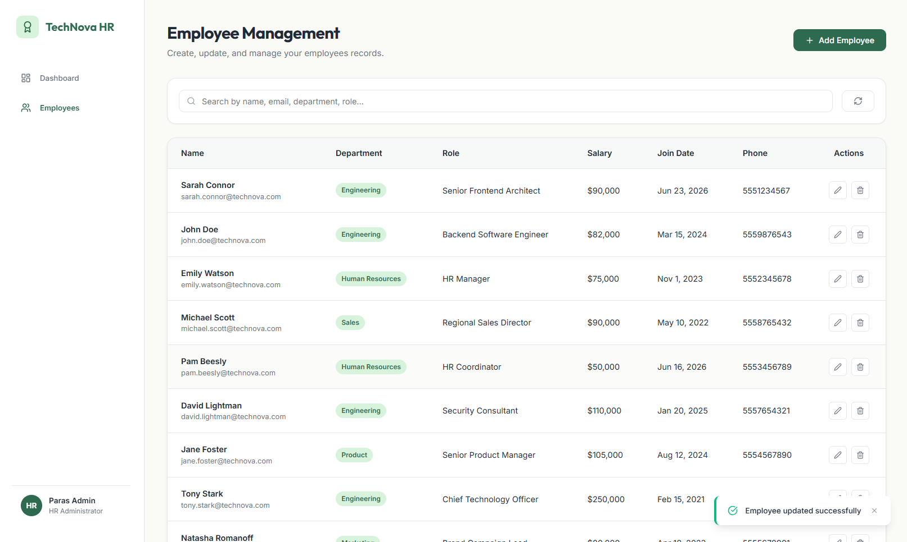

# Employee Management System

A production-ready, full-stack Employee Management System built for HR Administrators to monitor and manage employee records. The application includes a dynamic statistics dashboard, complete CRUD operations with search, sort, and pagination, strict server/client validations, and custom styled SaaS layout templates.

---

## Tech Stack

### Frontend

- **React.js (Vite)**: Quick hot-module-reloading (HMR) setup.
- **Axios**: HTTP client configuration for backend requests.
- **Lucide React**: Premium vector icons.
- **Vanilla CSS3**: Tailored layout structure (Grid/Flexbox), soft shadows, and clean animations (fade-in, slide-up, spinner rotation).

### Backend

- **Node.js & Express.js**: REST API server.
- **Mongoose / MongoDB**: ODM for database persistence, unique keys, and index constraints.
- **CORS**: Configured for cross-origin local testing.
- **Dotenv**: Environment configuration values loader.

---

## Features

### 1. HR Dashboard

- **Aggregate Analytics**: Calculates metrics dynamically from the database:
  - **Total Employees**: Total staff records.
  - **Departments**: Count of active departments.
  - **Average Salary**: Rounded calculation across all payroll.
  - **New Hires**: Count of staff joined in the current calendar month.
- **Overview Card**: Summarized company stats, active action ratio, and hiring speed index.
- **System Notices & Quick Actions**: Fast redirects to the employee list.

### 2. Employee Directory & Directory CRUD

- **Responsive Table**: Columns displaying Employee details, custom badges for departments, and action triggers.
- **Real-Time Search**: Debounced search inputs matching Name, Email, Department, or Role (updates without page refresh).
- **Column Sorting**: Sort by Name, Department, Salary, or Join Date with visual sorting arrows (Ascending/Descending).
- **Items Per Page**: Dynamic limit selector (5, 10, or 20 records per page).
- **Pagination Controls**: Previous/Next navigation with active page indicator buttons.
- **Add Employee**: Full validation checks for required inputs, email format checks, positive salaries, and 7-to-15 digit phone validation.
- **Edit Employee**: Pre-populates the fields in the modal form. Updates and verifies fields (ensuring email duplicates are prevented).
- **Delete Employee**: Soft confirmation modal overlay displaying employee name before purging records.
- **System Feedback**: Float toasts indicating Success, Info, or Error states.

---

## Project Structure

```text
CRUD Employee Management System/
│
├── Employee_Management_System_API.postman_collection.json  # API Collection file
├── README.md                                               # Documentation
│
├── server/                                                 # Backend API Server
│   ├── config/
│   │   └── db.js                                           # Mongoose DB connector
│   ├── controllers/
│   │   └── employeeController.js                           # DB handlers & Stats aggregation
│   ├── middleware/
│   │   ├── errorMiddleware.js                              # Centralized error mapping
│   │   └── validationMiddleware.js                         # Request payload checking
│   ├── models/
│   │   └── employeeModel.js                                # Mongoose Employee schema
│   ├── routes/
│   │   └── employeeRoutes.js                               # Express API route mapping
│   ├── scripts/
│   │   └── seed.js                                         # Mock records generator
│   ├── .env                                                # Configured variables
│   ├── .env.example                                        # Template for environment
│   ├── package.json                                        # Server packages
│   └── server.js                                           # Express initialization
│
└── frontend/                                               # React Client Web App
    ├── public/
    ├── src/
    │   ├── components/
    │   │   ├── ConfirmModal.jsx                            # Confirm delete modal
    │   │   ├── EmployeeFormModal.jsx                       # Form for Add/Edit
    │   │   ├── EmployeeTable.jsx                           # Grid list with pagination
    │   │   ├── Sidebar.jsx                                 # Navigation menu
    │   │   ├── Spinner.jsx                                 # Loading indicators
    │   │   └── Toast.jsx                                   # Status toast banner
    │   ├── hooks/
    │   │   └── useNotification.js                          # Toast notifications hook
    │   ├── pages/
    │   │   ├── Dashboard.jsx                               # Metrics & Summary view
    │   │   └── EmployeeManagement.jsx                      # Directory & Toolbar
    │   ├── services/
    │   │   └── api.js                                      # Axios service configuration
    │   ├── utils/
    │   │   └── formatters.js                               # Currency & date formatters
    │   ├── App.jsx                                         # Root layout shell
    │   ├── index.css                                       # CSS variables & typography
    │   └── main.jsx                                        # React entry point
    │
    ├── package.json                                        # Client packages
    └── vite.config.js                                      # Vite build configurations
```

---

## Installation & Setup

### Prerequisites

- [Node.js](https://nodejs.org/) (version 16.x or higher)
- [MongoDB Local Server](https://www.mongodb.com/try/download/community) running on port 27017, OR a [MongoDB Atlas Account](https://www.mongodb.com/cloud/atlas)

### 1. Database & Backend Configuration

1. Open your terminal and navigate to the `server/` directory:
   ```bash
   cd server
   ```
2. Install server-side dependencies:
   ```bash
   npm install
   ```
3. Create a `.env` file from the example template:
   ```bash
   copy .env.example .env
   ```
4. Verify the `.env` settings. The default local URI is:
   ```env
   PORT=5000
   MONGO_URI=mongodb://127.0.0.1:27017/employee_management
   NODE_ENV=development
   ```

### 2. Seeding Sample Data

To populate the database with 10 sample employee records across various departments (including hires joined in the current month):

```bash
npm run seed
```

_Expected console output:_

```text
Connected to MongoDB for seeding...
Cleared existing employee records.
Successfully seeded 10 employee records!
```

### 3. Running the Backend Server

Start the development server with live auto-reload (using nodemon):

```bash
npm run dev
```

The server will boot on `http://localhost:5000`.

---

### 4. Frontend Client Configuration

1. Open a new terminal tab/session and navigate to the `frontend/` directory:
   ```bash
   cd frontend
   ```
2. Install frontend dependencies:
   ```bash
   npm install
   ```
3. Boot the Vite development server:
   ```bash
   npm run dev
   ```
4. Open the browser and visit: `http://localhost:5173`.

---

## API Documentation

All routes are prefix-scoped to `/api/employees`.

### Endpoints

| HTTP Method | Route                            | Description                                              | Query Parameters                             |
| :---------- | :------------------------------- | :------------------------------------------------------- | :------------------------------------------- |
| **GET**     | `/api/employees`                 | Fetch paginated, sortable, and searchable employee list. | `search`, `sortBy`, `order`, `page`, `limit` |
| **GET**     | `/api/employees/dashboard/stats` | Fetch aggregated dashboard KPI counts and averages.      | None                                         |
| **GET**     | `/api/employees/:id`             | Fetch specific employee details.                         | None                                         |
| **POST**    | `/api/employees`                 | Add a new employee record.                               | None (Requires JSON body)                    |
| **PUT**     | `/api/employees/:id`             | Update an existing employee details.                     | None (Requires JSON body)                    |
| **DELETE**  | `/api/employees/:id`             | Remove an employee record from the database.             | None                                         |

### Sample Payloads

#### Create Employee (`POST /api/employees`)

**JSON Request Body:**

```json
{
  "name": "Sarah Connor",
  "email": "sarah.connor@technova.com",
  "phone": "5551234567",
  "department": "Engineering",
  "role": "Senior Frontend Architect",
  "salary": 95000,
  "joinDate": "2026-06-19"
}
```

**JSON Response (201 Created):**

```json
{
  "success": true,
  "message": "Employee added successfully",
  "data": {
    "_id": "60f785e495267b14d84a7e99",
    "name": "Sarah Connor",
    "email": "sarah.connor@technova.com",
    "phone": "5551234567",
    "department": "Engineering",
    "role": "Senior Frontend Architect",
    "salary": 95000,
    "joinDate": "2026-06-19T00:00:00.000Z",
    "createdAt": "2026-06-24T11:24:45.322Z",
    "updatedAt": "2026-06-24T11:24:45.322Z",
    "__v": 0
  }
}
```

---

## Design System & UX Choices

The UI design is implemented in `frontend/src/index.css` following professional SaaS styles:

- **Clean Background**: Pure off-white `#FAFAF7` background paired with white card containers to establish a solid structure.
- **Accents**: Soft forest green `#2D6A4F` for principal action indicators, paired with warm coral `#FF7F50` for highlights, avoiding high-contrast corporate blues.
- **Micro-Animations**: Clean inputs with focus rings, hover lift states (`transform: translateY(-4px)`), smooth modal blur fade-ins, and toast exit slides.
- **Responsiveness**: Fully responsive CSS. At viewport widths below `768px`, navigation menus collapse and form layout grids automatically wrap into a single column.

---

## Deployment Ready Guide

### Backend Deployment (Render)

1. Commit the project code to a GitHub repository.
2. In [Render](https://render.com/), create a new **Web Service** linked to your repository.
3. Configure the Root Directory setting to `server`.
4. Build command: `npm install`
5. Start command: `node server.js`
6. Add Environment Variables:
   - `MONGO_URI`: `mongodb+srv://<username>:<password>@cluster0.mongodb.net/employee_db`
   - `PORT`: `10000`
   - `NODE_ENV`: `production`

### Frontend Deployment (Vercel)

1. Add a `vercel.json` file in the `frontend` folder or root.
2. In [Vercel](https://vercel.com/), create a new project linked to your repository.
3. Set the Root Directory to `frontend`.
4. Configure the Framework Preset to **Vite**.
5. Build command: `npm run build`
6. Output directory: `dist`
7. Add Environment Variables:
   - `VITE_API_URL`: Set to your deployed Render URL (e.g., `https://your-app.onrender.com/api`).
     "# CRUD-Employee-Management-System"

---

## 📸 Screenshots Blueprint

Capture the following screenshots to fulfill the submission requirements:

1.  **`01_hr_dashboard.png`**: The HR Dashboard page showing the four metric cards populated with seeded numbers, system notices, and quick links.
    

2.  **`02_employee_directory.png`**: The Employee Directory page showing the responsive table, sorting indicators on column headers, and pagination controls.

3.  **`03_search_filter_active.png`**: The table after entering a search term (showing only filtered records).
    

4.  **`04_add_employee_modal.png`**: The "Add Employee" modal overlay displaying input fields.
    

5.  **`05_client_validation_error.png`**: The Add Form with active validation errors showing on empty/incorrect inputs.
    

6.  **`06_edit_employee_prefilled.png`**: The "Edit Employee" modal displaying prefilled data for a chosen employee.
    

7.  **`07_delete_confirmation.png`**: The soft confirmation delete modal indicating the employee name before purging.
    

8.  **`08_success_toast_notification.png`**: The floating success toast notification showing after a save/delete action.
    

---
